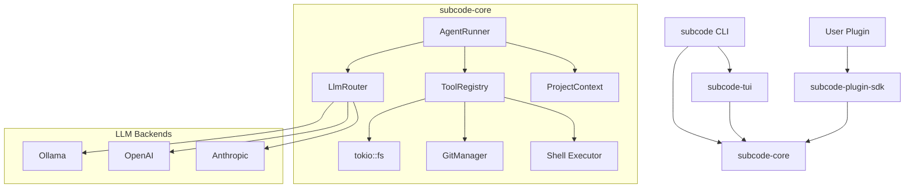

# SUB CODE Architecture

SUB CODE is a fast, compiled, terminal-native AI coding agent built in Rust 2021. This document explains the internal architecture, data flows, and the core execution loop.

## Workspace Crates

SUB CODE is split into four primary workspace crates:

1. **`subcode`** — The CLI entrypoint (`src/main.rs`, `src/cli.rs`, `src/setup.rs`).
2. **`subcode-core`** — The main engine containing the `AgentRunner`, LLM backends, built-in tools, Git/Shell abstractions, and `ProjectContext`.
3. **`subcode-tui`** — A `ratatui` + `crossterm` UI implementation that satisfies the `AgentUi` trait for rich terminal interactions.
4. **`subcode-plugin-sdk`** — The public ABI for building external plugins and tools.

---

## Module Diagram

---

## Data Flow

When SUB CODE starts a task, data flows continuously between the local project and the LLM via the core agent pipeline:

1. **Context Initialization**: `ProjectContext::build` scans the current directory using `walkdir` (respecting ignore files) to build an in-memory `CodeIndex` mapping file sizes, paths, and language types.
2. **Context Delivery**: The `CodeIndex`, alongside OS info, shell config, and tool schemas, is formatted into a dense text representation using `to_llm_string` and sent as the system prompt.
3. **Real-time Streaming**: As the LLM responds, the `LlmRouter` yields a continuous `TokenStream`. The tokens are sent to the `AgentUi` (e.g. the TUI) *in real-time*.
4. **Tool Execution**: When a JSON tool block is detected in the stream, the agent captures the `name` and `arguments`, finds the matching implementor in the `ToolRegistry`, and runs the tool asynchronously (modifying files, running shell commands, or interfacing with Git).
5. **Feedback Loop**: The `ToolResult` (STDOUT/STDERR, file read success, error strings) is formatted back into a user/system message and sent to the LLM to resume the thought process.

---

## The Core Agent Loop

The `AgentRunner` orchestrates the execution cycle. It does **not** rely on static "stop-and-go" requests; it maintains an open stream until the objective is reached. 

Here is the high-level loop for a background task (`run_task`):

1. **Start**: Initialize `Vec<ChatMessage>` with the system context and the user's initial prompt.
2. **Stream**: Open an active async stream to the configured LLM backend.
3. **Parse**: As `TokenEvent` structs arrive, yield text to the UI. If the LLM generates a tool block (e.g. `<tool_call>`), buffer the JSON until the block closes.
4. **Execute**:
    - Identify the tool by name.
    - Validate the JSON against the schema.
    - Yield control to the `Tool::execute` block.
    - Tools run in sandboxes (e.g. the `Shell` checks commands against `allowlist`/`denylist`).
5. **Continue or Exit**: 
    - If the tool succeeds or fails, append the `ToolResult` to the message history as a new turn.
    - Loop back to **Step 2** to let the LLM analyze the output.
    - If the LLM finishes its output *without* calling a tool, the run completes.
